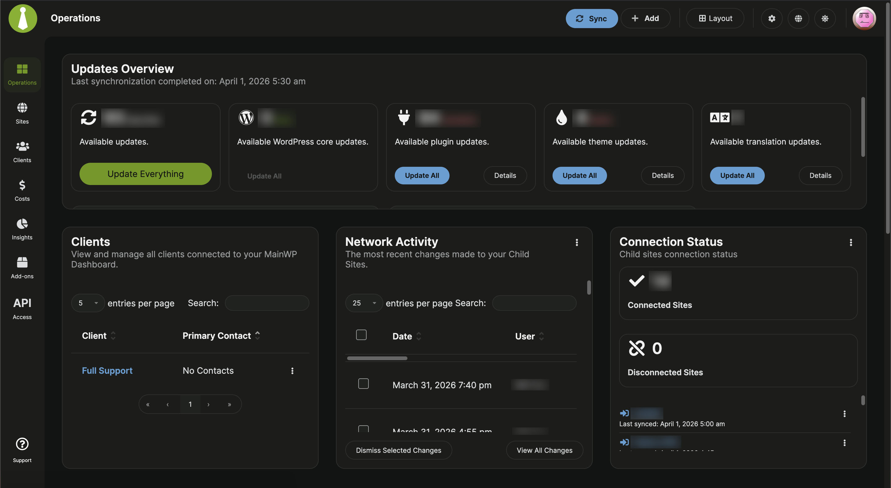

# Mothership — Centralised WordPress Management Infrastructure (Public)
 
## Overview
 
Mothership is a self-hosted, centralised management dashboard for over 15 WordPress client sites, built on [MainWP](https://mainwp.com/) and deployed to a dedicated subdomain on shared hosting. The project replaces a manual, site-by-site update workflow with a single control plane covering updates, uptime monitoring, and security visibility across all managed sites.
 
---
 
## Infrastructure
 
| Component | Detail |
|---|---|
| Dashboard URL | `[internal subdomain]` |
| Hosting | VentraIP shared hosting (LiteSpeed, Sydney AU) |
| Web server | Apache 2.4.66 |
| Database | MariaDB 10.6.25 |
| OS | Linux x86_64 |
| WP install | Clean, dashboard-only (no public-facing content) |
 
---
 
## Architecture
 
```
┌─────────────────────────────────────┐
│         Mothership Dashboard        │
│         [internal subdomain]        │
│                                     │
│  MainWP Dashboard Plugin            │
│  Real cron (*/15 * * * *)           │
│  WP-Cron disabled                   │
│  Frontend: maintenance mode (locked)│
└────────────────┬────────────────────┘
                 │ OpenSSL 2048-bit key pair
                 │ per-site Unique Security ID
        ┌────────┴────────┐
        ▼                 ▼
  [Client Site A]   [Client Site B]  ...×13
  MainWP Child      MainWP Child
  Plugin            Plugin
```
 
---
 
## Key Implementation Decisions
 
**Real cron over WP-Cron**
WP-Cron is pseudo-cron — it fires on page visits, not on schedule. A dashboard-only subdomain has near-zero traffic, making WP-Cron unreliable for background syncs. Replaced with a server-level cron job via cPanel executing every 15 minutes.
 
**WP-Cron disabled in `wp-config.php`**
```php
define('DISABLE_WP_CRON', true);
```
 
**cPanel cron job**
```
*/15 * * * * wget -q -O - https://[internal-subdomain]/wp-cron.php?doing_wp_cron >/dev/null 2>&1
```
 
**Security: no password auth + Unique Security ID**
MainWP's password authentication is only used for the initial handshake — it immediately generates an OpenSSL key pair for all subsequent communication. Password auth was disabled in favour of per-site Unique Security IDs, which must match before the dashboard can communicate with a child site. This prevents unauthorised dashboards from connecting to client sites.
 
**Frontend obscured via maintenance mode**
The Mothership subdomain serves no public content. A maintenance mode plugin intercepts all unauthenticated frontend requests. The WP admin and MainWP dashboard remain accessible to authenticated users. Directory-level password protection was evaluated and rejected — it intercepts all HTTP requests including WordPress core, breaking the dashboard.
 
---
 
## Operational Scope
 
- Over 15 client WordPress sites connected
- Bulk plugin, theme, and core update management
- Per-site uptime monitoring with email alerting (HTTP 200 checks)
- Security vulnerability visibility across all sites
- Site exclusion rules for known fragile installs (core update exclusions)
- UpdraftPlus backup scheduling managed per-site (weekly cadence)
 
---
 
## Backup Strategy
 
| Layer | Tool | Frequency |
|---|---|---|
| Application-level | UpdraftPlus | Weekly |
| Server-level | VentraIP automated backups | Hourly |
 
Offsite storage not implemented — redundancy provided by server-level hourly backups on managed hosting infrastructure.
 
---
 
## Decisions Not Taken
 
**MainWP Pro** — evaluated for centralised backup reporting. Not adopted. Backup coverage already provided by UpdraftPlus per-site and VentraIP server-level hourly backups. Centralised reporting is a visibility enhancement, not a functional gap.
 
**Directory Privacy (cPanel)** — evaluated for frontend obscurity. Rejected. `.htpasswd` protection intercepts all HTTP requests including WordPress internals, breaking the dashboard. Maintenance mode plugin used instead.
 
---
 
## DevOps Relevance
 
- **Systems thinking:** Designed a management layer that abstracts N sites behind a single control plane rather than managing each in isolation.
- **Automation:** Eliminated manual, site-by-site update cycles via scheduled background sync and bulk update pipelines.
- **Monitoring:** Proactive uptime alerting replaces reactive client-reported downtime discovery.
- **Security posture:** Per-site cryptographic identity (OpenSSL key pairs + Unique Security IDs) rather than shared credential access.
- **Infrastructure decisions documented:** Each architectural choice recorded with rationale and rejected alternatives.
 
---
 
## Stack
 
- WordPress (dashboard instance)
- MainWP Dashboard + Child plugins
- VentraIP cPanel shared hosting
- Apache / MariaDB
- UpdraftPlus
- Linux cron

---

## Screenshot


